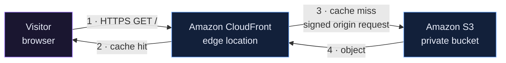
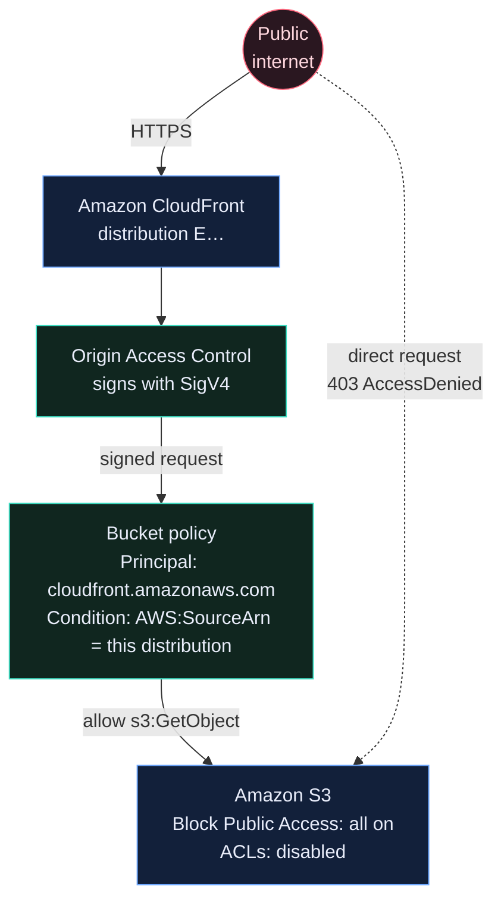
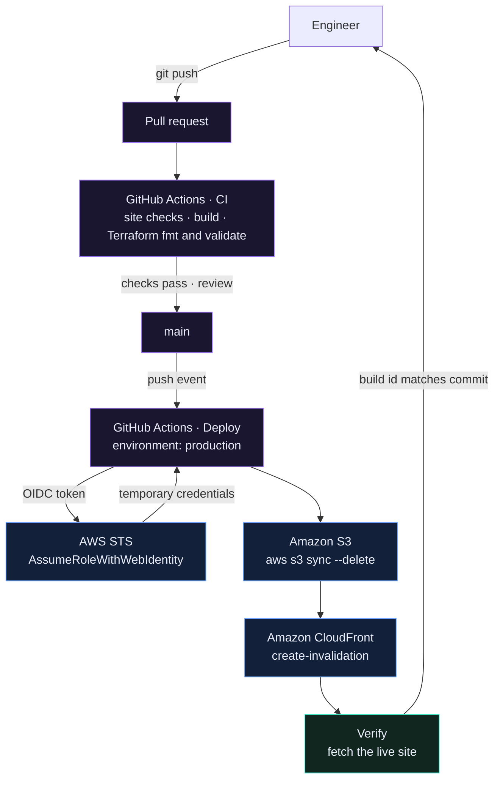
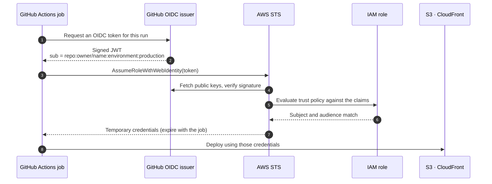
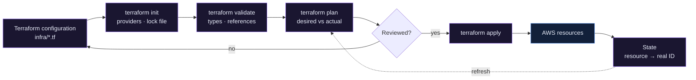
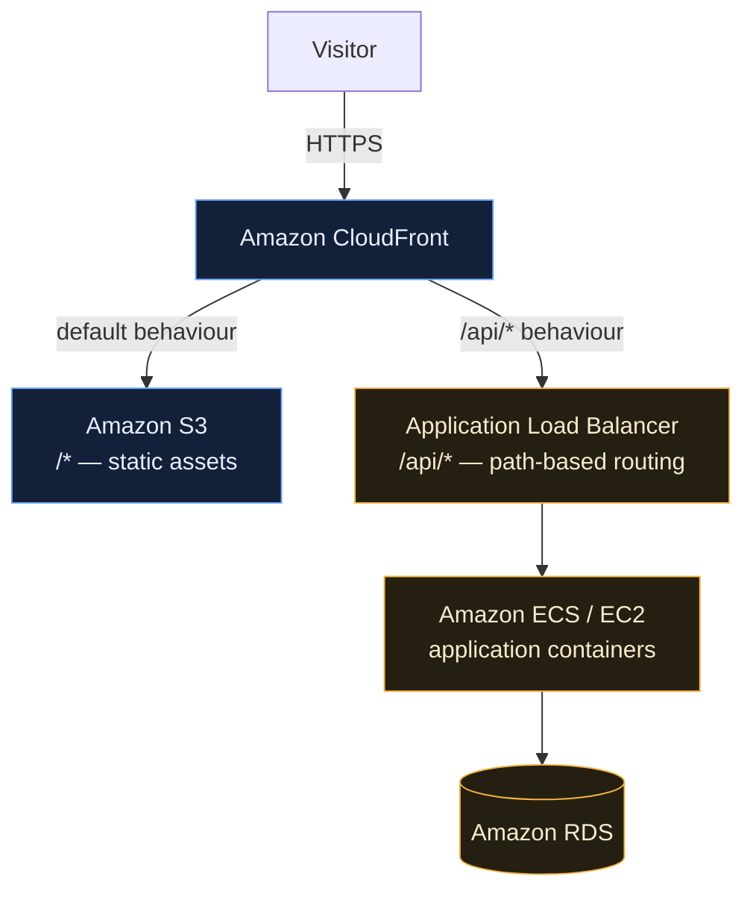

# Architecture

How the platform fits together, why each piece is there, and what the request
actually does.

---

## 1. Application architecture

The whole system in one picture. There is no server, no runtime and no database —
just objects in a bucket and a CDN that knows how to read them.



Most requests stop at step 2. The origin is only consulted when an edge location has
nothing cached for that path, which for a static site is a small fraction of traffic.

**Why not just S3 static website hosting?** S3 can serve a website directly from a
public bucket, and it is one checkbox. It also gives you plain HTTP with no
certificate, no CDN, no compression control, no security headers, and a bucket policy
granting `s3:GetObject` to the entire internet. CloudFront costs nothing extra at this
scale and removes every one of those problems.

---

## 2. Security path

The part that keeps the bucket private while the site stays public.



Four independent controls have to agree before an object is served:

| Control | What it does |
| --- | --- |
| Block Public Access | Overrides any policy or ACL that would make the bucket public |
| `BucketOwnerEnforced` | Disables ACLs entirely, leaving one access model instead of two |
| Origin Access Control | CloudFront signs every origin request with SigV4 |
| Bucket policy | Grants `s3:GetObject` to the CloudFront service principal — and only when `AWS:SourceArn` matches this distribution |

Remove that `AWS:SourceArn` condition and any CloudFront distribution in any AWS
account can serve your bucket. The token is genuine; it simply is not yours. This is
the confused deputy problem, and the condition is the fix.

---

## 3. CI/CD pipeline



CI and deployment are separate workflows because they need different permissions. CI
runs on pull requests from forks and holds no credentials — the worst it can do is
fail. Deployment holds `id-token: write` and runs only on `main`.

---

## 4. GitHub to AWS authentication

No AWS access key exists anywhere in this repository.



The trust policy is the security boundary. It pins:

- **`aud`** to `sts.amazonaws.com`
- **`sub`** to this repository and an explicit list of refs and environments

A token from another repository is perfectly valid, correctly signed by GitHub, and
rejected — because its `sub` claim does not match.

Compare that with the alternative: an IAM user's access key pasted into GitHub
Secrets. It never expires, is not bound to a repository, a branch or a workflow, and
survives every rotation policy you forget to run.

---

## 5. Terraform workflow



`plan` compares three things: the configuration, the state file, and the real
resources. Anything changed outside Terraform shows up here as **drift**, which is why
`plan` is worth running even when you have changed nothing.

---

## 6. Where this goes next: adding a backend

This project has no Application Load Balancer, and that is deliberate — an ALB in
front of S3 would be an idle bill. But the architecture is a foundation, not a
dead end. The moment there is an application to run, the shape changes:



CloudFront gains a second origin and an ordered cache behaviour for `/api/*`. The
static half of the architecture does not change at all — which is the point of
building it this way.

---

## Cost

Everything here is inside or near the AWS free tier for a small site, but nothing on
AWS is free forever.

| Service | What is billed | Notes |
| --- | --- | --- |
| S3 | Storage, requests | A few megabytes of static site is fractions of a cent per month |
| CloudFront | Data transfer out, requests | The dominant cost at scale; negligible for a lab |
| CloudFront invalidations | Paths beyond 1,000/month | `/*` counts as one path |
| ACM | Nothing | Public certificates for AWS services are free |
| Route 53 | Hosted zone per month, queries | Only if you use it — DNS elsewhere costs nothing here |
| IAM, OAC | Nothing | No charge for roles, policies or access controls |

The one line item that can surprise you is CloudFront data transfer, and only if the
site gets real traffic. Nothing in this project runs continuously, which is why the
teardown is one command and why you should use it.

```bash
cd infra && terraform destroy
```
